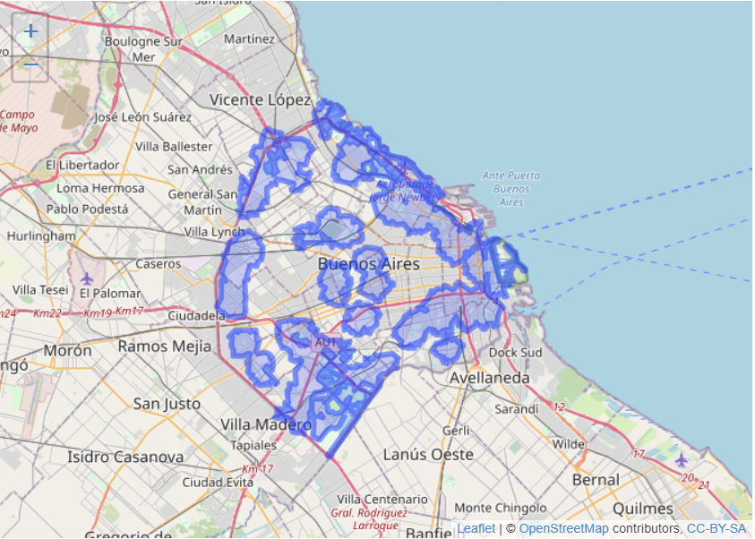
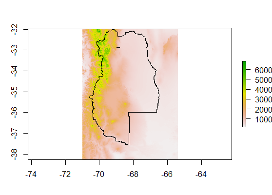

```{css, echo=FALSE}
# CSS for including pauses in printed PDF output (see bottom of lecture)
@media print {
  .has-continuation {
    display: block !important;
  }
}
.large4 { font-size: 400% }
.large2 { font-size: 200% }
.small90 { font-size: 90% }
.small75 { font-size: 75% }
```


# Nuestro camino
.middle[
1. [Análisis espacial](#whatisit)

2. [Tipo de datos espaciales](#vectorandraster)

3. [Sistemas de coordenadas de referencia](#crs)

4. [Simple Features (sf)](#howinr)

5. [Bibliografía y extensiones](#resumen)
]
---
class: inverse, center, middle
name: whatisit

# ¿Qué es el análisis espacial?

<html><div style='float:left'></div><hr color='#EB811B' size=1px width=796px></html>

---

# ¿Qué es el Análisis Espacial?

- En un sentido estricto es un conjunto de herramientas que nos permiten analizar **datos geográficos**

- Estos **datos geográficos** no son otra cosa que datos que tienen de manera implícita o explícita una ubicación en la tierra.

* Como veremos, esta característica particular nos requiere estudiar en profundidad:

  + ¿Cómo son representados en la Tierra?

--

  + ¿Cómo se almacenan?

--

  + ¿Cómo se analizan?
---
class: inverse, center, middle
name: vectorandraster

# Tipo de datos espaciales

<html><div style='float:left'></div><hr color='#EB811B' size=1px width=796px></html>
---
# Tipo de datos espaciales
* Los datos espaciales pueden expresarse en dos modelos clásicos  
--

1. **Modelo vectorial**. En este modelo los datos espaciales son **puntos**, **lineas** o **polígonos**. La información espacial es expresada como coordenadas de los puntos, inicio y final de las lineas o vértices, en caso de los polígonos.

--

  Ejemplo: accesibilidad a grandes espacios públicos en CABA
```{r,out.height="400px", out.width="562px", echo=FALSE, fig.align='center'}

```

---
# Tipo de datos espaciales
2. **Modelo ráster**. En el modelo ráster se divide a un espacio en grillas de igual tamaño. Cada una de estas unidades (a veces llamadas *píxeles* o *celdas*) tienen uno o más valores asociados. Suele ser muy usado, por ejemplo, debido al análisis de imágenes satelitales, pero también, por ejemplo para análisis del uso de la tierra o mostrar la elevación de una superficie.

--

  Ejemplo: elevación de Mendoza
```{r,out.height="400px", out.width="562px", echo=FALSE, fig.align='center'}

```

---
# Archivos de datos espaciales

- Tanto **vectores** como **rasters** tienen tipos de archivos distintos

--

<br>

- Archivos más comunes para **vectores**
  + Shapefile: De los formatos más ampliamente difundidos. Están compuestos por más de un archivo y es propiedad de ESRI (creadores de ArcGis)<br>
  + Geojson: Son listas basadas en el standard JSON. **Por definición desde ya hace unos años es obligatorio usar la proyección WGS84**<br>
  + KLM: Son etiquetas basadas en XML

--

<br>
- Archivos más comunes para **rasters**
  + GeoTIFF
  + JPEG(2000)
---
class: inverse, center, middle
name: crs

# Sistema de coordenada de referencia

<html><div style='float:left'></div><hr color='#EB811B' size=1px width=796px></html>
---

# Sistema de coordenada de referencia

- Todos los datos espaciales tienen **implícita o explícitamente una ubicación en la tierra**

- Cuando trabajamos con ellos, siempre tenemos que saber en que *unidad* de medida está expresado.

- Así como si alguien nos dice que algo pesa 10 no podemos saber si son gramos, kilos o toneladas, **un conjunto de coordenadas por sí solas no alcanzan para saber de qué posición en la tierra estamos hablando**.

- Los **Sistemas de Coordenada de Referencia (CRS)** son los encargados de identificarnos la "unidad" en la que están expresados nuestros datos espaciales.

- La principal diferencia entre CRS es que pueden ser Sistemas de Coordenadas Geográficas o Sistemas de Referencia de Coordenadas Proyectadas

---
# Coordenadas geográficas

- En este caso, las coordenadas usadas son **longitud** y **latitud**. En ambos casos, se trata de la distancia - en grados - contra la "linea" del Meridiano de Greenwich y contra la línea del ecuador, respectivamente

- En general, en estos CRS la tierra se modela como un **elipsoide**.

- Este **elipsoide** puede ajustarse para representar de mejor manera una región del planeta (NAD83 es usado para EE.UU.), o puede representar bien en "promedio" al planeta (WGS84, standard internacional)

- Hay que tener mucho cuidado al hacer procesamiento (tomar distancias, entre otras operaciones) con estos datos porque NO están expresados en una unidad de distancia constante (metros, kilómetros)

---
# Coordenadas proyectadas

- Independientemente del elipsoide que elijamos, los mapas están en dos dimensiones.

- Esto nos obliga a **proyectar** un objeto tri-dimensional, lo que siempre va a tener algún trade-off.

- **Nunca** vamos a poder representar de manera simultánea a nuestros objetos en las siguientes cuatro dimensiones:
  + Area
  + Dirección
  + Distancia
  + Forma

- Las coordenadas, en los CRS Proyectados, tienen una unidad "constante", como metros o kilométros.

- En este tipo de coordenadas podemos calcular distancias, centroides o buffers sin grandes complicaciones.

---
# Pistas para trabajar con CRS

- Los archivos .geojson están **siempre** en la proyección WGS84

- Existen dos formas muy usadas de almacenar información sobre el CRS de nuestros datos. **EPSG Codes** y **proj4string**.

- Los **EPSG Codes** son simplemente un listado de CRS definidos. Por ejemplo, el código 4326 corresponde a WGS84

- **proj4string** resume los parámetros del CRS. El correspondiente al EPSG 4326 es el siguiente texto: *+proj=longlat +ellps=WGS84 +datum=WGS84 +no_defs*

- La página https://spatialreference.org/ es un excelente recurso para buscar información sobre sistemas de coordenas de referencia

- Como regla general, si las coordenadas toman valores entre -180,180 entonces no están proyectadas.

---
class: inverse, center, middle
name: howinr

# Simple Features (sf)

<html><div style='float:left'></div><hr color='#EB811B' size=1px width=796px></html>
---
# Simple Features (sf)

- R tiene un conjunto de paquetes que nos permiten trabajar con datos espaciales.

- El paquete sf es muy útil para trabajar con datos espaciales vectoriales.

- Para la instalación hay que tener RTools instalado (Windows), y quizás tengan que instalar algunos paquetes adicionales vía Homebrew en MacOS o en la Terminal de Ubuntu. Para más información, https://r-spatial.github.io/sf/

- Lo mejor de sf es que es un data.frame con una columna adicional que contiene las coordeanadas de nuestros datos... podemos aplicar (casi) todas las herramientas del resto de tidyverse.

---
class: inverse, center, middle
name: resumen

# Bibliografía y extensiones

<html><div style='float:left'></div><hr color='#EB811B' size=1px width=796px></html>
---
# Bibliografía y extensiones

- El análisis de datos espaciales es una discplina que está avanzando mucho durante las últimas décadas. Aquí van algunas recomendaciones para usar R para análisis espacial, y un resumen del análisis estadístico de datos espaciales para curiosos y curiosas

- [Análisis Espacial en R (notas de clase); Montané](https://martinmontane.github.io/AnalisisEspacialEnR/)

- [Geocomputation with R; Lovelace, Nowosad y Muenchow](https://geocompr.robinlovelace.net/)

- [Spatial Data Science; Pebesma, Bivand](http://r-spatial.org/book)

- [Fundamentos de econometría espacial aplicada; Herrera Gómez](https://aaep.org.ar/publicaciones/download/UnaNuevaEconometria.pdf)
