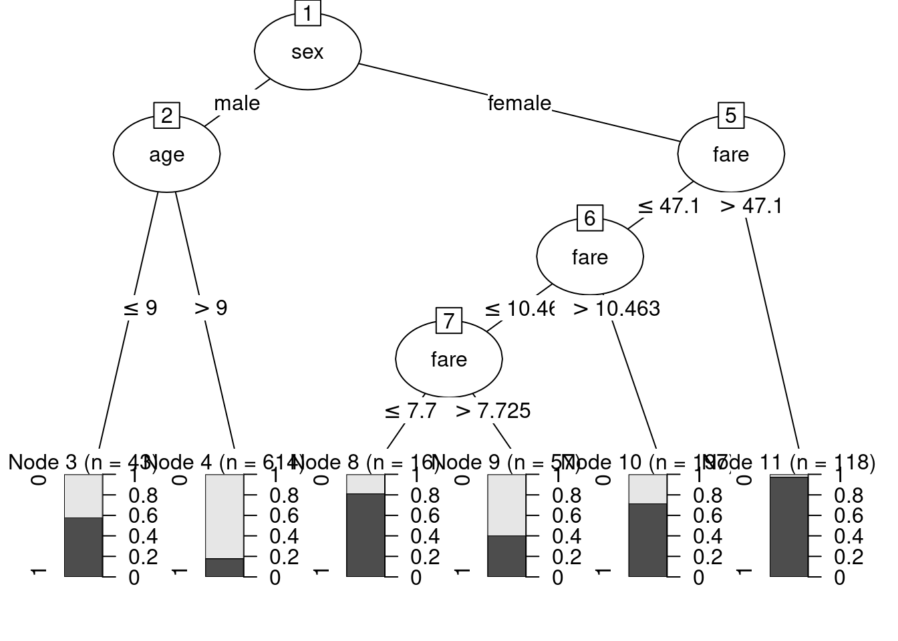
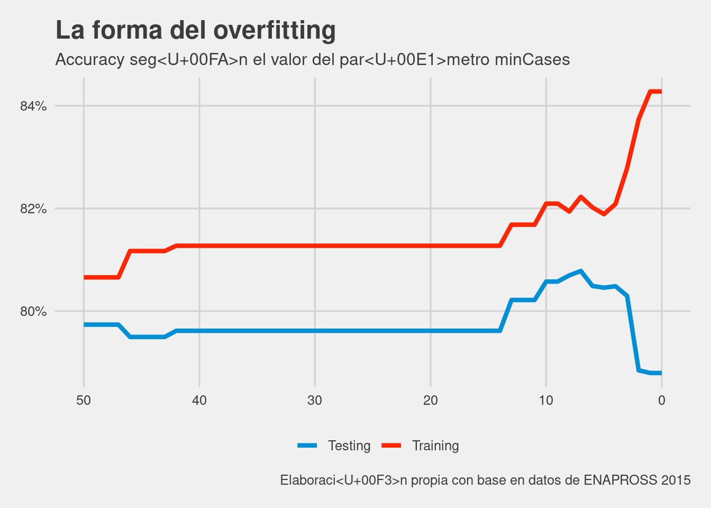

```{css, echo=FALSE}
# CSS for including pauses in printed PDF output (see bottom of lecture)
@media print {
  .has-continuation {
    display: block !important;
  }
}
.h1{font-size: 50%}
.large4 { font-size: 400% }
.large2 { font-size: 125% }
.small90 { font-size: 90% }
.small75 { font-size: 75% }
}
```
# Nuestro camino
.center[.middle[
1. [¿A qué llamamos aprendizaje automático?](#whatisit)

2. [Sesgo, varianza y error irreducible](#Errors)

3. [Predecir, no memorizar: training, testing y cross validation](#traintesting)

4. [Los rolling stones: árboles de decisión](#decisiontrees)

5. [Árboles de decisiones en R](#decisiontreesinR)

6. [Óptimización de parámetros](#parametertuning)

7. [Ventajas y desventajas de los árboles de decisión](#proscons)

8. [Making trees great again: Bagging and boosting](#baggingandboosting)

9. [Random forests](#randomforests)

10. [Resumen](#summary)

11. [Bibliografía](#biblio)

]]
---
class: inverse, center, middle
name: whatisit

# ¿De qué hablamos cuando decimos aprendizaje automático?

<html><div style='float:left'></div><hr color='#EB811B' size=1px width=796px></html>

---
# Qué es Aprendizaje Automático?

.center[.middle[
> "La capacidad de un programa de aprender a hacer una tarea cada vez mejor en base a la experiencia... Se dice que un programa de computadora aprende de la Experiencia (E) con respecto a una determinada clase de tareas (T) y medida de Performance (P) si la Performance en el conjunto de Tareas mejora conforme se acumula Experiencia"
> [`r tufte::quote_footer('--- Tom Mitchell (Machine Learning, 2017)')`](http://profsite.um.ac.ir/~monsefi/machine-learning/pdf/Machine-Learning-Tom-Mitchell.pdf)

]]

--

- El foco está puesto en la capacidad de las computadoras (o programas) de <span style='color: #e41a1c;'><b>aprender a predecir</b></span> en base a la experiencia

---
# Y el aprendizaje estadístico?

- Muchos de ustedes quizás conocen otro término: <span style='color: #e41a1c;'><b>aprendizaje estadístico</b></span>

- Este término está más relacionado con <span style='color: #377eb8;'><b> estimar la relación entre un conjunto de variables</b></span> ya sea para <span style='color: #fdbf6f;'><b>inferir</span></b> una relación entre las variables o  <span style='color: #33a02c;'><b>predecir</span></b>

--

- Dicho de otra forma, imaginen que tenemos por un lado una variable $Y$ y por otro lado un conjunto de variables explicativas $X = (X_1,X_2,...,X_p)$

- En el aprendizaje estadístico estamos interesados en estimar 

.center[
$Y = f(X) + \epsilon$
]

--

- <span style='color: #e7298a;'><b>Ya sea que hablemos de aprendizaje automático o aprendizaje estadístico, las herramientas utilizadas para predecir suelen ser las mismas </b></span>

---
class: inverse, center, middle
name: Errors

# Sesgo, varianza y error irreducible

<html><div style='float:left'></div><hr color='#EB811B' size=1px width=796px></html>

---

# Error reducible e irreducible

- Cuando estimamos la relación entre un conjunto de variables, nuestro error de predicción puede descomponerse en dos partes

.center[
$\underbrace{E(Y-\hat{Y})^2}_{Error\space Promedio} =$ <span style='color: #e7298a;'> $\underbrace{E[f(X)-\hat{f}(X)]^2}_{Error\space Reducible}$ </span> $+$  <span style='color: #377eb8;'> $\underbrace{Var(\epsilon)}_{Error\space Irreducible}$ </span>
]

--

- El <span style='color: #e7298a;'> Error Reducible </span> existe porque siempre aproximamos a la relación real entre los datos: en la gran cantidad de las aplicaciones, no conocemos realmente la relación entre las varaibles.

- El <span style='color: #377eb8;'> Error Irreducible </span> existe por muchas razones, solo por nombrar algunas pueden ser variables que no incluímos en el modelo u otras que nunca podríamos medir

--
> Concédeme serenidad para aceptar todo aquello que no puedo cambiar, fortaleza para cambiar lo que soy capaz de cambiar y sabiduría para entender la diferencia.

--

- Somos capaces de mejorar el <span style='color: #e7298a;'> Error Reducible </span>
---
# Trade-off entre esgo y varianza

- Imaginemos que queremos **seleccionar** el mejor modelo para predecir. Necesitamos una guía: usemos el <span style='color: #e7298a;'>Mean Square Error (MSE) </span> 

.center[.large2[
$$ \color{#E7298A}{MSE} = (1/\color{olive}{n})\sum_{i=1}^{\color{olive}{n}}(\color{purple}{y_i} - \color{orange}{\hat{f}(x_i)})^2$$
]]

- Donde $\color{olive}{n}$ es la cantidad de observaciones

- $\color{purple}{y_i}$ es el valor observado para la observación i

- $\color{orange}{\hat{f}(x_i)}$ es el valor predicho dada la aproximación y los valores de las variables para la observación i

---
# Trade-off entre sesgo y varianza

- No importa de qué modelo estemos hablando, es posible demostrar que podemos descomponer la parte "reducible" en dos partes adicionales, por lo cual nuestros errores quedarían así:

.center[.large2[
$$\color{#E7298A}{MSE}= \color{#377EB8}{\underbrace{(f - E[\hat{f}])^2}_{Sesgo^2}} + \color{#D95F02}{\underbrace{Var(\hat{f})}_{Varianza}} + \color{#8DD3C7}{\underbrace{Var(\epsilon)}_{Error\space Irreducible}}$$
]]

- <span style='color: #377EB8;'>Sesgo</span> es cuanto nos equivocamos en promedio si tuvieramos muchas muestras

- <span style='color: #D95F02;'>Varianza</span> es cuantá volatilidad tenemos en las predicciones de nuestro modelo cuando cambian los datos

- <span style='color: #8DD3C7;'>Error Irreducible</span> el error que surge de factores que no podemos medir, entre otras fuentes.

---
# Trade-off entre sesgo y varianza

- Dada esta fórmula, está claro lo que hay que hacer: minimizar tanto el sesgo como la varianza.

- Pero los modelos de aprendizaje automático/estadístico en general tienen una <span style='color: #4DAF4A;'>reducción en sesgo (varianza) </span> a cambio de una <span style='color: #E41A1C;'> suba en la varianza (sesgo) </span>

- Por ejemplo, la regresión lineal nos da estimadores **insesgados** bajo ciertas condiciones, pero otros modelos pueden sacrificar sesgo a cambio de una reducción superior de **varianza**

- Con nuestros datos nunca sabemos qué parte es sesgo, cual parte es varianza y cuál es error irreducible, pero **sí sabemos que nuestro objetivo es <span style='color: #1F78B4;'>reducir el error en las predicciones </span>, y esto implica encontrar la mejor combinación sesgo-varianza**


---
class: inverse, center, middle
name: traintesting

# Predecir, no memorizar: training, testing y cross validation

<html><div style='float:left'></div><hr color='#EB811B' size=1px width=796px></html>

---
# El objetivo es predecir <span style='color: #ff7f00;'>casos nuevos</span>
- Hasta el momento sabemos que tenemos que elegir el modelo que mejor predice a los casos.
--

- Hagamos trampa y simulemos un conjunto de datos generados por una función que ya conocemos
.small75[
.center[
.middle[
$x = 2 + \epsilon_x$

$y = x - 2x^2 + 0.25x^3 + \epsilon_y$
]
]
]
.center[.middle[
```{r echo=FALSE, out.height="300px", out.width="350px"}

```
]
]
.small75[
$\epsilon_x$ y $\epsilon_y$ son errores normales con media cero, pero distinto desvío estándard
]
---
# ¿Cuál es el mejor modelo?
.center[.middle[
```{r echo=FALSE, out.height="550px", out.width="800px"}

```
]
]
---
# ¿Cuál es el mejor modelo?

- Elegimos al modelo que tiene 10 coeficientes como el mejor modelo, en base al MSE y lo que aprendimos hasta ahora.
--


- Simulemos otras diez observaciones y veamos qué sucede con el mejor modelo y el resto, que tienen un mayor MSE
---
# De nuevo: ¿Cuál es el mejor modelo?
.center[.middle[
```{r echo=FALSE, out.height="550px", out.width="800px"}

```
]
]

---
#  El objetivo es predecir <span style='color: #ff7f00;'>casos nuevos</span>

- Hicimos lo que dijimos al principio, minimizar MSE, pero elegimos el modelo que **más error tuvo** al predecir datos nuevos

- Esto es porque caímos en las aguas del **ovefitting** o **sobreajuste**: aprendimos demasiado de los datos

- ¿Cuál fue el mejor modelo cuando observamos datos nuevos?: **El que estima la relación que realmente existe en los datos ** Esto es bueno ¿no?

- Separar nuestros datos en un conjunto de entrenamiento y de validez (o training y testing) puede ayudarnos a no caer nunca en este error

- **Siempre tenemos que elegir al modelo según su eficacia con un conjunto de datos que no entrenó**

---
# Crossvalidation: aprovechando los datos

- En la realidad no contamos con datos ilimitados ni conocemos la función original que genera los datos

- Separar solo una vez entre training y testing puede funcionar mal... podemos tener mala suerte !

- Solución: separar a nuestros datos en k grupos de igual tamaño

- **Entrenar** sobre las observaciones de k-1 grupos

- **Predecir** sobre las observaciones del grupo que sobró

- Una vez que se hizo esto para cada uno de los grupos, se **Promedia**

- Idea: tener una medida **robusta** de la capacidad predictiva de nuestro modelo


$$CV_\color{#E7298A}{k} = \frac{1}{\color{#E7298A}{k}} \sum_{i=1}^\color{#E7298A}{k} MSE_i$$
---
# Crossvalidation: aprovechando los datos
.center[.middle[
```{r echo=FALSE, out.height="550px", out.width="800px"}
knitr::include_graphics("graficosIntroAprendizajeAutomatico/kfolds.png")
```
]
]
---
class: inverse, center, middle
name: decisiontrees

# Los rolling stones: árboles de decisión

<html><div style='float:left'></div><hr color='#EB811B' size=1px width=796px></html>

---
# Árboles de decisión

- Son un tipo de algoritmos particular que nos ayudan a **predecir** el valor de una variable en base a un conjunto de otras variables

- Más específico: es un algoritmo que "hace" preguntas con el objetivo de segmentar a todo nuestro dataset en grupos excluyentes entre ellos

-¿Difícil? No tanto: recuerden el *¿Quién es quién?*:
  * Hombre/Mujer?
  * Anteojos o no
  * Pelo negro o no?
  * y sigue la lista...

- Esto se llama **Recursive Partioning** y es una de las claves de los árboles de decisión

---
# Árboles de decisión

- En un ejemplo donde yo tuviera una mujer que tuviera anteojos, y solo exitiese una con estas características, mi contrincante ganaría haciendo dos preguntas:

</img>

---
# Árboles de decisión

- Resumiendo: los árboles hacen preguntas para separar a la variable que queremos predecir en el espacio de las variables explicativas

- Esto es simplemente hacer preguntas y separar a los casos en los distintos **nodos**

- Los árboles de decisión **tienen una función que intentan minimizar** a cada paso

- Cambia en distintos tipos de árboles, pero siempre la idea es la misma: separar **al oro de la piedra**

- Además hay otros parámetros que el árbol usa para terminar de hacer preguntas, o quizás no hacer preguntas demasiado particulares. Ya volveremos a este punto 

---
class: inverse, center, middle
name: decisiontreesinR

# Árboles de decisión en R
<html><div style='float:left'></div><hr color='#EB811B' size=1px width=796px></html>
---
# Árboles de decisión en R: C5.0

- El **paquete C50** nos permite entrenar árboles de decisión con el algoritmo C5.0, originalmente desarrollado por Ross Quinlan.

- Como veremos en breve, lo que hace este algoritmo a grandes rasgos es preguntarse cómo mejorar **la entropía** en cada uno de los puntos

$$Entropia(\color{#EB811B}{S}) = \sum_{i=1}^\color{#377eb8}{c} - \color{#4daf4a}{p_i}log_2(\color{#4daf4a}{p_i}) $$
donde $\color{#EB811B}{S}$ es un subconjunto de nuestros datos, $\color{#377eb8}{c}$ es cada uno de los valores que puede la variable que intentamos predecir y $\color{#4daf4a}{p_i}$ es la proporción que está en esa clase

- La entropía es simple: cuando no separa bien a los grupos, da un valor alto, cercano a 1. Cuanto mejor separa a nuestros datos, da un valor menor y más cercano a 0

- Como nuestros conjuntos suelen ser variables que toman dos o más valores, el árbol ponderará la entropía según cuantos casos hayan en cada grupo

$$Entropia(\color{#EB811B}{S}) = \sum_{i=1}^\color{#984ea3}{n} \color{#377eb8}{w_i}Entropy(P_i)  $$
---
# Árboles de decisión en R: C5.0

- En rigor, C5.0 usa **Information Gain** para elegir como segmentar a nuestros casos

- **Information Gain** es tan solo la diferencia en la entropía antes y después de elegir la variable

- Vamos a usar el **dataset de Titanic** para este primer ejemplo.
```{r message=FALSE, warning=FALSE}
require(tidyverse)
require(C50)
```
```{r}
titanic <- read.csv(file = "https://raw.githubusercontent.com/martintinch0/CienciaDeDatosParaCuriosos/master/data/titanic.csv",
                    stringsAsFactors = FALSE,
                    sep = ';')
glimpse(titanic)
```
---
# Árboles de decisión en R: C5.0

- Podemos usar un árbol de decisión para predecir quién sobrevive y quien no al titanic?
```{r echo=FALSE, out.height="550px", out.width="800px"}

```
---
# Árboles de decisión en R: C5.0


- ¿Qué variable eligió para empezar a separar los datos?

Respuesta: Género ¿Porqué? Porque maximiza **information gain**, la medida "guia" que usa este árbol para elegir que variable usar.

--
- ¿Qué otras variables usó?

Respuesta: Edad y tarifa ¿Porqué? Porque maximizan **information gain** en sus respectivos nodos (dentro de los hombres y dentro de las mujeres).

Dicho de otra manera, una vez que nos quedamos con los hombres **la edad es la variable más útil para distinguir sobrevivientes**. Cuando sabemos que son mujeres, **la tarifa es más importante**.
--

- ¿Cómo quedaron los nodos finales? ¿Observan algún patrón?

Quizás ven algo distinto que yo, pero las mujeres con precio de tarifas caras son una apuesta segura a haberse salvado. Hombres mayores a 9 años, una buena apuesta a no haber sobrevivido. El resto es relativamente mixto

---
# Árboles de decisión en R: C5.0

- ¿Qué tan bien predice este árbol de decisión? Existen distintas medidas para evaluar esto

- Partamos con la **matriz de confusión**

```{r echo=FALSE, message=FALSE, warning=FALSE}
library(kableExtra)
kable(data.frame(Real=c("Murió","Sobrevivió"),
           Murió=c(538,133),
           Sobrevivió=c(80,294)),table.attr = "style='width:30%;' height:'50px;'") %>%
  kable_styling("striped") %>%
  add_header_above(c("","Predicción" = 2))
```

- Esto da una "tasa de acierto" (o **accuracy**) del 79,6%. Si hubieramos dicho que morían todos, entonces teníamos una **accuracy** de 59%.

- El lift, es decir la mejora de nuestro modelo, es del 35% (pista: 79.6 / 59 - 1)

- Esta medida la podemos usar para comparar entre cualquier modelo con clasificación categórica.
---
class: inverse, center, middle
name: parametertuning

# Optimización de parámetros

<html><div style='float:left'></div><hr color='#EB811B' size=1px width=796px></html>

---
# Optimización de parámetros

- Todos los modelos o algoritmos de aprendizaje automático/estadístico tienen **parámetros**

- Estos parámetros controlan diferentes propiedades de estos modelos.

- En el caso particular del algoritmo C5.0, dos parámetros pueden ser importantes para la predicción:  <span style='color: #e41a1c;'><b>cf</b></span> y <span style='color: #377eb8;'> <b>minCases</b></span>.

- <span style='color: #e41a1c;'><b>cf</b></span>: Confidence factor. C5.0 primero crea un árbol muy grande y lo va podando (*prunning*) dependiendo de este valor. Va entre 0 y 1, mientras más cerca de 0, más fuerte será este podado

- <span style='color: #377eb8;'> <b> minCases</b></span>: establece la cantidad mímina de casos que tiene que haber en las "hojas" de los árboles al abrir por esa variable. Mientras más alto, más se exige para cortar nuevamente los datos 

- Se prueban distintos parámetros y se eligen **los que arrojen el menor error de predición**
---
# Optimización de parámetros

```{r echo=FALSE, out.height="550px", out.width="800px"}

```
---
class: inverse, center, middle
name: proscons

# Ventajas y desventajas de los árboles de decisión

<html><div style='float:left'></div><hr color='#EB811B' size=1px width=796px></html>
---
# Ventajas de los árboles de decisión

- Fáciles de explicar (incluso más fácil que la regresión lineal)

- Los podemos ver e interpretar fácilmente de manera visual

- Pueden manejar variables categóricas y cuantitativas sin mayores problemas

- También pueden predecir variables binarias o cuantitativas

---
# Desventajas de los árboles de decisión

- En general son superados por otros modelos de predicción

- No son robustos: cambiar alguno de los nodos de los árboles cambia drásticamente la predicción

---
class: inverse, center, middle
name: baggingandboosting

# Making trees great again: Bagging and boosting

<html><div style='float:left'></div><hr color='#EB811B' size=1px width=796px></html>
---
# Bagging

- Los árboles pueden ser superadiso por otros modelos de predicción, y esto tiene que ver con que no son robustos

- Dicho de otra forma, tienen una **varianza** muy alta

- <span style='color: #377eb8;'> <b> Bagging</b></span> es una idea muy interesante

- No nos preocupemos por la varianza y hagamos árboles que sobreajusten a nuestros datos

- Pero entrenemos **muchos** con los mismos datos, modificándolos un poco

- Luego promediamos la predicción de cada uno de los árboles

- De está manera podemos lograr un mejor trade-off entre sesgo y varianza, mejorando el error
---
# Boosting

- Otra idea opuesta a bagging pero que sirve para mejorar el problema de los árboles de decisión

- Entrenamos de manera secuencial árboles "cortos" que claramente no sobreajustan, sino que todavía pueden mejorar su predicción

- Con los errores de esos árboles, se entrenan otros árboles también generales

- Se frena cuando la ganancia en la predicción con el nuevo árbol es relativamente baja
---
class: inverse, center, middle
name: randomforests

# Random forests

<html><div style='float:left'></div><hr color='#EB811B' size=1px width=796px></html>
---
# Random forest

- Ya estamos en condiciones de introducir uno de los algoritmos más usados: random forests

- Se basan en la idea de  <span style='color: #377eb8;'> <b> bagging </b> </span>

- Con un pequeño cambio... para cada uno de los árboles, cuando tiene que elegir por cuál variable abrir, solo se le permite elegir sobre un subconjunto de variables

- ¿Cuál es la lógica? Que no abra siempre por la misma variable... sino que aproveche información de otras variables en nuestro dataset

- El paquete **randomForest** nos permite estimar un modelo de random forest

---
# Random forest: monotributistas

- Vamos a trabajar con un ejemplo aplicable para políticas públicas

- Imaginense que quieren diseñar un programa de transferencias para los trabajadores independientes que no facturan

- Se sorprenderán, pero en Argentina no hay información sobre esto en la Encuesta Permanente de Hogares (EPH)

- ¿Qué podemos hacer? Tomar otra encuesta que si lo hizo en algún momento y entrenar un modelo para predecir luego en la EPH

- La Encuesta de Protección y Seguridad Social (ENAPROSS) nos da una oportunidad para esto
---
# Random forest: monotributistas

```{r}
# Cargamos los datos y los describimos brevemente
load(file=url("https://github.com/martintinch0/CienciaDeDatosParaCuriosos/raw/master/data/independientes.RData"))
glimpse(independientes)
```

---
# Random forest: monotributistas
```{r message=FALSE, warning=FALSE}
library(randomForest)
# Elegimos los casos que van a ser testing
testIndex<- sample.int(nrow(independientes),0.2*nrow(independientes))
# Datos de training
datosTraining <- independientes %>% slice(-testIndex)
rf <- randomForest(formula= REGISTRADO ~.,data=datosTraining,mtry=3, ntree=100)
dataTesting <- dataTraining <-independientes %>% slice(testIndex)
pred <- predict(rf,newdata = dataTesting)
table(pred,dataTesting %>% pull(REGISTRADO))
```

- En base a esta table podemos calcular la accuracy

```{r}
tabla <- table(pred,dataTesting %>% pull(REGISTRADO))
sum(diag(tabla))/sum(tabla)
```
---
# Random forest: crossvalidation

- El código para crossvalidation es un poco más complejo, vamos a mostrar los resultados de accuracy para 5 distintos parámetros de <span style='color: #377eb8;'> <b> mtry </b> </span>.

- <span style='color: #377eb8;'> <b> mtry </b> </span> es la cantidad de variables que se pueden elegir en cada "punto" de cada árbol.

- Mostramos dos filas: en una dejamos solo un árbol, en otra pedimos 100 árboles
```{r message=FALSE, warning=FALSE, echo=FALSE}
library(kableExtra)
kable(data.frame(t(data.frame(`ntree=1`=c(0.7545772,0.7560205,0.7437961,0.7190063,0.7233254),
           `ntree=100`=c(0.8055905,0.7976878, 0.7865490, 0.7729025, 0.7660763)))),table.attr = "style='width:30%;' height:'50px;'",  col.names=c("1","2","3","4","5")) %>%
  kable_styling("striped") %>%
  add_header_above(c("","mtry" = 5))
```

- Los random forest son particularmente interesantes cuando existen muchas variables, quizás más que en este ejemplo.

.small75[
El código que genera esto [pueden mirarlo acá]()
]
---
class: inverse, center, middle
name: summary

# Resumen

<html><div style='float:left'></div><hr color='#EB811B' size=1px width=796px></html>
---
# Resumen
- Los modelos de aprendizaje automático/estadístico tienen por objetivo predecir de la manera más eficiente

- Por más eficiente hacemos referencia a alguna medida de precisión específica

- Esta eficiencia debe siempre medirse a la luz de la capacidad predictiva de nuevos casos

- Los árboles de decisión son una de las herramientas más clásicos

- Son simples de entender y funcionan muy bien con relaciones no lineales 

- Lamentablemente, tienen mucha **varianza**, por lo cual suelen ser superados por otros modelos

- **Bagging** y **Boosting** son dos principios aplicables a diversos modelos, pero especialmente útiles para los árboles y compensan al menos parcialmente este problema

---
class: inverse, center, middle
name: biblio

# Bibliografía

<html><div style='float:left'></div><hr color='#EB811B' size=1px width=796px></html>
---
# Bibliografía

- Inicial: [*Big data*,Walter Sosa Escudero](https://www.cuspide.com/9789876298995/Big+Data)

- Intermedio/avanzado: [*An Introduction To Statistical Learning*, James, Witten, Hastie and Tibshirani, capitulos 2, 5 y 8](http://faculty.marshall.usc.edu/gareth-james/ISL/)

- Avanzado: [*The Elements of Statistical Learning*, Friedman, Hastie and Tibshirani](https://web.stanford.edu/~hastie/Papers/ESLII.pdf)

