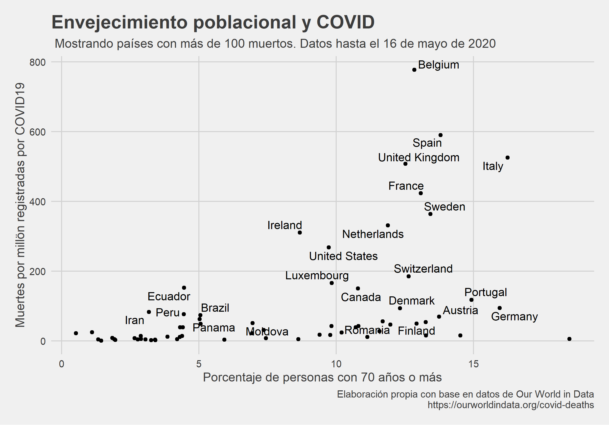
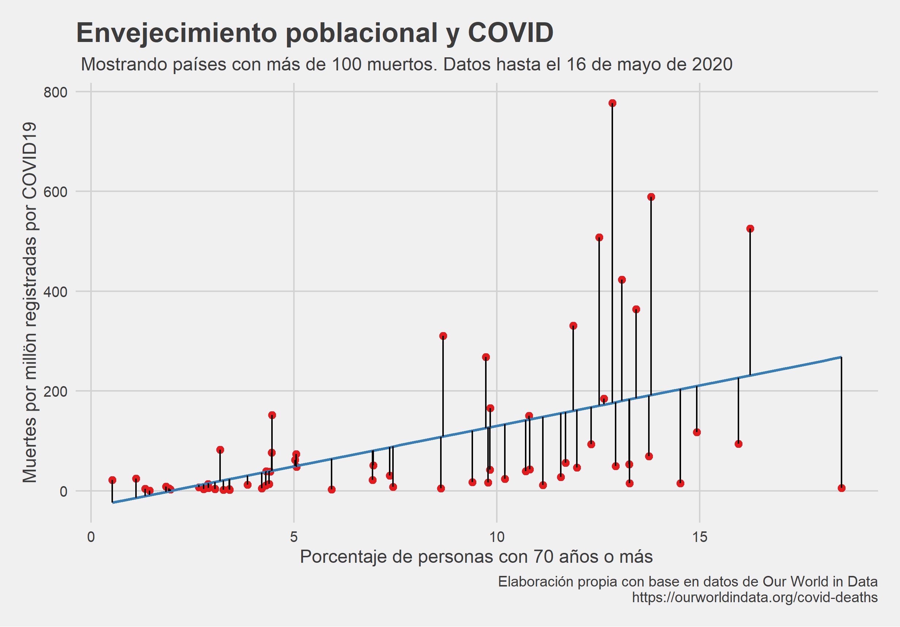
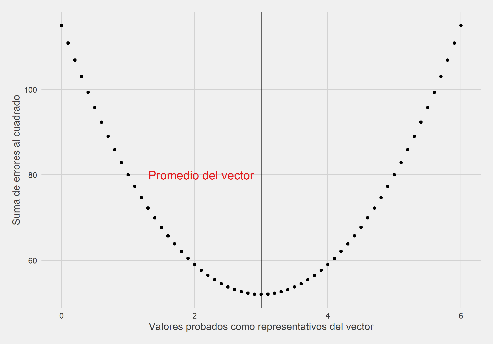
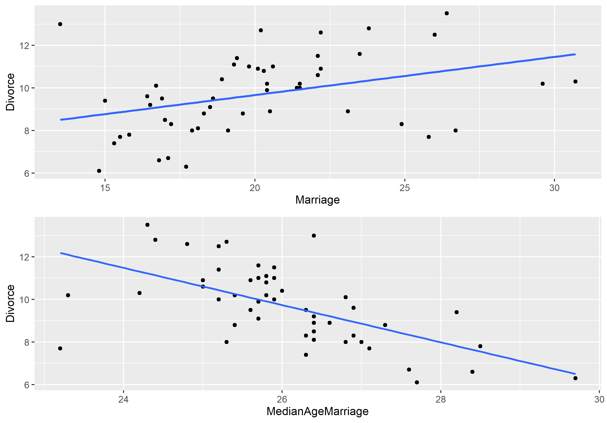
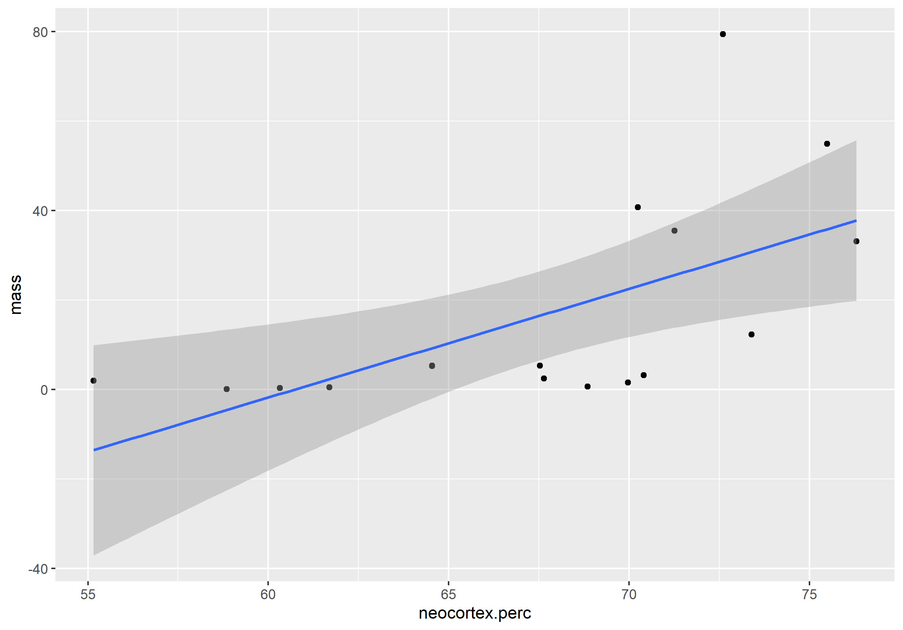
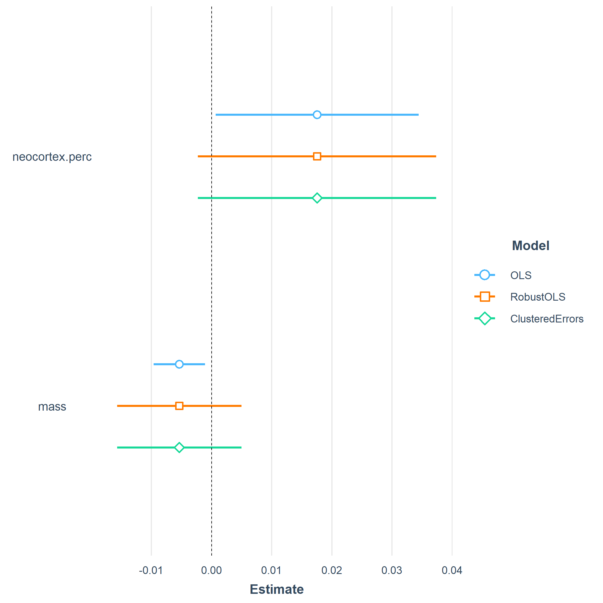

```{css, echo=FALSE}
# CSS for including pauses in printed PDF output (see bottom of lecture)
@media print {
  .has-continuation {
    display: block !important;
  }
}
.large4 { font-size: 400% }
.large2 { font-size: 200% }
.small90 { font-size: 90% }
.small75 { font-size: 75% }
```


# Nuestro camino
.middle[
1. [¿Qué es una regresión lineal?](#whatisit)

2. [La regresión hace... promedios](#regpromedios)

3. [¿Cómo podemos hacer regresiones en R?](#howinr)

4. [Regresión lineal múltiple y sus beneficios](#regMult)

5. [Herramientas de visualización y presentación de regresiones](#extensionesReg)

6. [Resumen](#resumen)
]
---
class: inverse, center, middle
name: whatdataviz

# ¿Qué es una regresión?

<html><div style='float:left'></div><hr color='#EB811B' size=1px width=796px></html>

---

# ¿Qué es una regresión?
.middle[
- Es un modelo (estadístico?) que nos permite resumir las relaciones entre una variable que queremos explicar en función de otro conjunto de variables.

- La regresión más famosa es la **regresión lineal**: nuestra variable depende linealmente del resto de las variables explicativas

- Podemos pensarla desde diferentes ángulos (inferencia, mecánica, geométrica...)

- En esta clase vamos a verla exclusivamente desde el **punto de vista "mecánico"**.

- Para esto vamos a tener que ver explicar qué es el método de **Mínimos Cuadrados Ordinarios (MCO)**
]
---
class: inverse, center, middle
name: regpromedios

# La regresión hace... promedios

<html><div style='float:left'></div><hr color='#EB811B' size=1px width=796px></html>

---
# La regresión hace... promedios

- Mínimos Cuadrados Ordinarios (MCO) es uno de los métodos más comunes para estimar la relación entre el conjunto de nuestras variables explicativas y la variable que queremos explicar

- Lo que hace es muy simple, pero vayamos paso por paso con un ejemplo interesante
--
.center[.middle[
```{r echo=FALSE, out.width="600px", out.height="400px"}

```
]]

---

# La regresión hace... promedios

- ¿Cómo podemos resumir la regresión entre estas dos variables?

- Idea de MCO: encontrar la recta que minimice el error con todas las observaciones 

- Otra forma de verlo: encontrar una recta que mejor describa a los datos que registramos

--

.center[.middle[
```{r echo=FALSE, out.width="600px", out.height="400px"}

```
]]

---
# La regresión hace... promedios

- ¿Cómo encuentra esta regla? Tiene un objetivo: **minimizar la suma del error cuadrático**

- El error cuadrático no es otra cosa que la sumatoria de los errores entre la predicción y el valor observado... elevado al cuadrado

- Idea importante: minimizar la sumatoria de los errores al cuadrado siempre nos lleva a un promedio

```{r}
vector <- c(0,2,3,9,1,2,4)
# mean(vector) El promedio de este vector es 3
valores <- seq(0,6,by=0.1)
```

- Vamos a calcular la suma de errores cuadráticos para todos los valores entre 0 y 6, yendo de a 0.1


---

# La regresión hace... promedios

- El promedio es el valor que minimiza la suma de errores al cuadrado 

.center[.middle[
```{r echo=FALSE, out.width="600px", out.height="400px"}

```
]]

- Resumiendo: la regresión nos ayuda a encontrar de manera eficiente la relación promedio entre las variables
---
class: inverse, center, middle
name: howinr

# Regresiones en R

<html><div style='float:left'></div><hr color='#EB811B' size=1px width=796px></html>

---

#  Regresiones en R: funciones claves

- <b>L</b>inear <b>M</b>odel **lm(<span style='color: #377eb8;'>formula </span>, <span style='color: #4daf4a;'>data</span>)**. Es la función que estima el modelo.

- La <span style='color: #377eb8;'>**formula**</span> tiene la siguiente sintáxis:
.center[.middle[
variableAExplicar ~ variable1 + variable2 ... + variableN
]]

- <span style='color: #4daf4a;'>**data**</span> solo contiene nuestro data frame. Las variables en la formula hacen referencia a columnas de nuestro data.frame

- Ejemplo: el dataset **salarios** tiene dos variables: **salario** y **genero** de un conjunto de trabajadores

.center[.middle[
lm(formula=salarios ~ genero, data = salarios)
]]

Es equivalente a estimar el siguiente modelo

.center[.middle[
$salario = \beta_0 + \beta_1*genero + \epsilon$
]]

Donde la estimación de $\beta_0$ y $\beta_1$ nos dará la recta que más cerca pasa por el conjunto de puntos. $\epsilon$ es un vector que tiene los desvios entre la recta y los puntos

---
#  Regresiones en R: funciones claves

.center[.middle[
```{r echo=FALSE, message=FALSE, warning=FALSE}
load("datosSalarios.RData")
library(tidyverse)
```

```{r}
regresion <- lm(formula=Salario ~ Genero, data=datos)
```
]]


- Para ver los principales resultados de la estimación, tenemos que usar **summary()**
.small75[
```{r size="huge"}
summary(regresion)
```
]

- Presten atención a **(Intercept)** $\beta_0$ y a **GeneroMujer** $\beta_1$: los valores estimados son 28932,9 y -6459,3

---
# Regresiones: interpretando la regresión
- Nuestra variable dependiente era el salario y nuestra variable explicativa era una variable binaria que identificaba el género de las persona

- Lo que nos dijo es que **en promedio** las personas que no son mujeres ganan 28.932,9 pesos

- También **en promedio** las mujeres ganan menos 6.459,3 que los hombres... ¡La regresión es una máquina de hacer promedios!

```{r}
datos %>% group_by(Genero) %>% summarise(promedio=round(mean(Salario),1))
```
```{r}
28932.9-22383.6
```

Exactamente nuestros coeficientes
---

# Regresiones: interpretando la regresión

- Volvamos al ejemplo de la relación entre la cantidad de muertos y la proporción de personas con 70 o más años

```{r echo=FALSE, message=FALSE, warning=FALSE}
load("datosCovid.RData")
```
.small75[
```{r}
regresion <- lm(data=datos, formula=muertesMillones ~ aged_70_older)
summary(regresion)
```
]

- Interpretación: en promedio una unidad más de la variable independiente (en este caso, 1% en la población mayor de 70 años) se asocia en promedio con 16.3 muertos por millones más

---

# p. valor 

- OK: la regresión **siempre** calcula promedios de la relación entre nuestra variable dependiente y nuestras variables explicativas

- Esto lo hace mecánicamente ¿Cómo saber si esa relación surgió al azar?

- En la saluda de las regresiones anteriores van a ver una columna que es **Pr(>|t|)**, allí está calculado nuestro p.valor

- La idea: comparar al parámetro que surgió de nuestros datos versus los que hubieran surgido si en realidad la relación entre nuestras variables no existía

- Comparar lo observado versus el azar ¿Cuándo estamos seguros que nuestros datos no son consistentes con que no exista relación entre las variables? Probablemente nunca.

- Hay cierto (endeble) consenso: 10%, 5%, 1% ? 

- **Siempre** este resultado es condicional al modelo y a los datos con los que lo estimamos

- A veces mejor interpretarlo como algo continuo antes que como algo "discreto"

---
# Intervalo de confianza

- Idea: ¿cuál es el intervalo en el cual se encontraría nuestro coeficiente si tomaramos infinitas muestras?

- R lo estima por nosotros con la función **confint()**. Solo tenemos que pasarle con qué probabilidad queremos que el coeficiente haya caído entre ese intervalo.

- Mientras mas grande la probabilidad, obviamente más grande el intervalo

.center[.middle[
```{r}
confint(regresion,level = 0.97)
```
]]

- Si hubieramos hecho 100 veces el muestreo, en el 97% de los casos hubieramos detectado que las mujeres ganaban entre -7.281 y -5.817 pesos que los hombres.
---
class: inverse, center, middle
name: gooddataviz

# Regresión lineal múltiple y sue beneficios

<html><div style='float:left'></div><hr color='#EB811B' size=1px width=796px></html>

---

# Regresión lineal múltiple

- Hasta ahora trabajamos relaciones entre dos variables, pero en la regresión podemos agregar muchas más variables.

- Puede ser útil para evitar **relaciones espurias** o para identificar **relaciones enmasacaradas**.

- Veamos unos nuevos datos: tasa de divorcios en los Estados Unidos según edad mediana al casarse y tasa de casamientos

---

# Relaciones espurias
- Ambas variables (edad mediana al casarse y la tasa de casamiento) parecen asociarse negativa y positivamente con la tasa de divorcios

.center[.middle[
```{r echo=FALSE, out.height="400px", out.width="600px"}

```
]]

---
# Relaciones espurias
- Qué pasa si ponemos las dos variables explicativas juntas?
```{r echo=FALSE}
load(url("https://github.com/datalab-UTDT/GIS2/raw/master/Data/WaterDivorce.RData"))
```
.small75[
```{r}
regMulti <- lm(WaffleDivorce,formula =  Divorce ~ MedianAgeMarriage + Marriage)
summary(regMulti)
```
]

- Ahora no solo Marriage cambió de signo, sino que nuestros datos son consistentes con una relación nula entre la tasa de casamiento y de divorcio 
---
# Controlando por otras variables

- ¿Por qué cambiaron los coeficientes? Porque en la regresión múltiple controlamos a cada una de las variables explicativas con respecto al resto

```{r}
regPorPartesMarriage <- lm(WaffleDivorce,formula =  Marriage ~  MedianAgeMarriage)
WaffleDivorce$residuosEdad <- resid(regPorPartesMarriage)
regPorPartesMarriage <- lm(WaffleDivorce, formula =  Divorce ~ residuosEdad)
```
.small75[
```{r}
summary(regPorPartesMarriage)
```
]

---
# Controlando por otras variables

- Lo mismo hace con la variable de edad

```{r}
regPorPartesMedianAge <- lm(WaffleDivorce,formula =  MedianAgeMarriage ~ Marriage)
WaffleDivorce$residuosMarriage <- resid(regPorPartesMedianAge)
regPorPartesMedianAge <- lm(WaffleDivorce, formula =  Divorce ~ residuosMarriage)
```
.small75[
```{r}
summary(regPorPartesMedianAge)
```
]

---

# Relación enmascarada

- Podemos aprovechar a la regresión múltiple en otro caso muy común: cunado dos relaciones que existen se cancelan entre sí.

- Ejemplo: en biología se discute si hay relación entre energía en la leche materna y el tamaño del cerebro

- Hacemos la regresión simple con una sola variable: no parece haber relación
```{r echo=FALSE}
load(url("https://github.com/martintinch0/CienciaDeDatosParaCuriosos/raw/master/data/milk.RData"))
milk <- milk[complete.cases(milk),]
```
.small75[
```{r}
regresion <- lm(data = milk, formula = kcal.per.g ~ neocortex.perc)
summary(regresion)
```
]

---


# Relación enmascarada

- Agreguemos, ahora, el peso de la madre a la regresión

.small75[
```{r}
regresion <- regresion <- lm(data = milk, formula = kcal.per.g ~ neocortex.perc + mass)
summary(regresion)
```
]

- Hay una relación positiva y significativa entre el tamaño del neocortex y la energía en la leche marterna!

---
# Relación enmascarada

- El punto es que existe una relación positiva entre el tamaño del neocortex y el peso de la madre

```{r echo=FALSE, out.height="400px", out.width="600px"}

```

- Pero ambas variables tienen una relación distinta con la cantidad de energía en la leche materna, de tal manera que se cancelan en la regresiones individuales
---
class: inverse, center, middle
name: extensionesReg

# Herramientas para visualizar y exportar nuestras regresiones

<html><div style='float:left'></div><hr color='#EB811B' size=1px width=796px></html>

---

# Algunas herramientas de R (broom)

- Muchos y muchas de ustedes ya saben y vieron qué es una regresión lineal: cómo puedo aprovechar a R para esto?

- **broom** nos sirve para tener más información - y quizás mejor organizada - sobre nuestra regresión

```{r}
library(broom)
```
.small75[
```{r}
tidy(regresion)
```
```{r}
glance(regresion)
```
]
---

# Algunas herramientas de R (estimatr)

- Podemos usar estimatr para hacer regresiones robustas...
.small75[
```{r}
library(estimatr)
robustOLS <- lm_robust(kcal.per.g ~ neocortex.perc + mass, data = milk)
tidy(robustOLS)
```
]
- Clusterizar errores estandard
.small75[
```{r}
clustered <- lm_robust(kcal.per.g ~ neocortex.perc + mass, data = milk,clusters = clade)
tidy(clustered)
```
]
---

# Algunas herramientas de R (huxtable)

```{r message=FALSE, warning=FALSE, paged.print=FALSE}
require(huxtable)
```

.small75[
```{r message=FALSE}
huxreg(regresion,robustOLS,clustered)
```
]
---
# Algunas herramientas de R (jtools)

- Comparar coeficientes modelos gráficamente

```{r message=FALSE, warning=FALSE, paged.print=FALSE}
require(jtools)
```
.small75[
```{r eval=FALSE}
plot_coefs(regresion,robustOLS,clustered,model.names = c("OLS","RobustOLS","ClusteredErrors"))
```
]
```{r echo=FALSE, out.height="500px", out.width="500px"}

```
]

---
# Algunas herramientas de R (jtools 2)

- Mostrar las predicciones asociadas a valores de nuestras variables explicativas

.center[.small75[
```{r eval=TRUE, out.height="400px", out.width="400px"}
effect_plot(regresion,plot.points = TRUE,pred = "neocortex.perc")
```
]]

---
# Y muchas otras herramientas

- El paquete **AER** para estimar modelos con variables instrumentales

- **PLM** para trabajar con datos de panel

- **rstanarm** para estimar modelos bayesianos

- **vars** para estimar VAR y VECms

- y muchos paquetes más...

- Recomiendo mucho [este link](https://raw.githack.com/uo-ec607/lectures/master/08-regression/08-regression.html#software_requirements) para usuarios más avanzados de regresiones

- Y [este curso](https://github.com/edrubin/EC607S20) para los que estén interesados en inferencia causal en R

---
class: inverse, center, middle
name: Resumen

# Resumen de la clase

<html><div style='float:left'></div><hr color='#EB811B' size=1px width=796px></html>

---

# Resumen

- La regresión puede interpretarse como una forma muy conveniente de calcular promedios entre distintas variables

- Esto lo vimos de una manera muy simple: minimizar la suma de dierencias al cuadrado equivale a buscar un promedio

- El p.valor nos sirve para saber, dado un modelo y nuestras observaciones, en qué medida pudimos encontrar ese parámetro si en realidad no hubiera relación

- El intervalo de confianza nos sirve para saber en qué intervalos de números se encontraría el parámetro estimado si hicieramos un muestreo muchas veces

- La regresión múltiple es una herramienta muy útil: regresa a cada una de las variables explicativas luego de controlar al resto de las variables

- Esto nos puede servir para no caer en relaciones enmascaradas o espurias.

---

# Lecturas para profundizar

- Nivel introductorio: [Big data, Walter Sosa Escudero](https://www.cuspide.com/9789876298995/Big+Data)

- Nivel intermedio (bayesiano): [Statistical Rethinking](https://www.bookdepository.com/es/Statistical-Rethinking-Richard-McElreath/9781482253443?ref=grid-view&qid=1589830731469&sr=1-1)

- Nivel intermedio: [Introduction To Statistical Learning, James, Witten, Hastie y Tibshirani, capítulos 2 y 3](http://faculty.marshall.usc.edu/gareth-james/ISL/ISLR%20Seventh%20Printing.pdf)

- Para consultas generales: [Econometric Analysis of Cross Section and Panel Data, Jeffrey Wooldridge](https://mitpress.mit.edu/books/econometric-analysis-cross-section-and-panel-data-second-edition)

- Regresiones e inferencia causal (nivel intermedio/avanzado): [Mastering Metrics: The path from cause to effect, Angrist & Pischke](https://www.amazon.es/Mastering-Metrics-Path-Cause-Effect/dp/0691152845)
